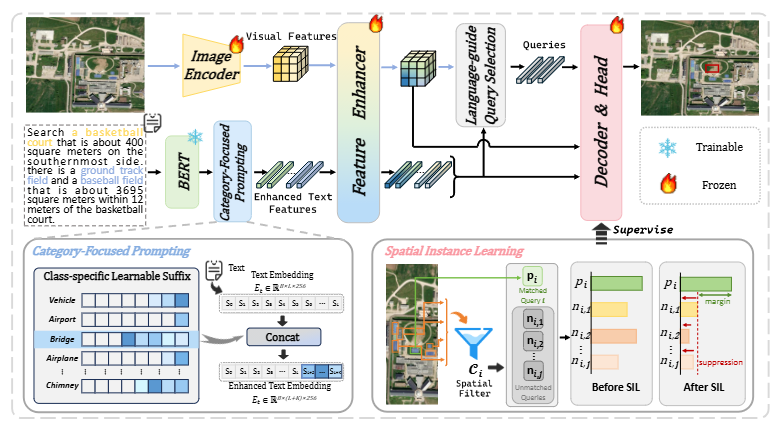
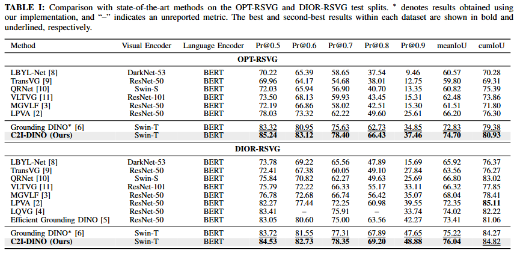

# Remote Sensing Visual Grounding with Grounding DINO

[](https://www.python.org/)
[](https://pytorch.org/)
[](https://github.com/open-mmlab/mmdetection)

## Overview

Remote sensing visual grounding (RSVG) aims to localize objects described by natural-language expressions in large-scale aerial images. Compared with conventional visual grounding, RSVG contains many repeated objects and long-range spatial relations, requiring a model to preserve the requested category cue while distinguishing the referred instance from similar objects.

To address this challenge, we propose **C2I-DINO**, a category-to-instance framework built on Grounding DINO. It introduces **Category-Focused Prompting (CFP)**, which retrieves learnable category-specific prompts and appends them to the projected text memory before cross-modal fusion, and **Spatial Instance Learning (SIL)**, which uses ranking and suppression losses to separate the matched query from high-response queries at incorrect locations during training. Both modules retain the original image-expression input and inference interface. SIL is confined to training and leaves inference unchanged.

Extensive experiments on RSVG, OPT-RSVG, and DIOR-RSVG demonstrate that C2I-DINO achieves state-of-the-art performance on most reported metrics.



## Key Features

- Grounding DINO with a Swin-T visual backbone.
- Class-specific le  arnable text suffixes for stronger category representations.
- Spatial contrast learning for suppressing confusing nearby proposals.
- Training and evaluation configurations for RSVG, DIOR-RSVG, and OPT-RSVG.
- Data conversion, evaluation, visualization, and experiment scripts.
- An experimental IR-visible dual-branch rotated Grounding DINO prototype in `dual_grounding_dino_enhance_share_w.py`.

## Repository Structure

```text
.
├── configs/                         # Dataset and experiment configurations
│   ├── rsvg/
│   ├── dior_rsvg/
│   └── opt_vg/
├── mmdet/                           # MMDetection framework and customized modules
├── tools/                           # Training, evaluation, conversion, and visualization tools
├── scripts/                         # Common experiment scripts
├── pretrained/                      # Place downloaded pretrained models here
├── docs/                            # Porting and license notes
└── dual_grounding_dino_enhance_share_w.py
```

## Datasets

The experiments use RSVG, DIOR-RSVG, and OPT-RSVG. Please download each dataset from its official source and comply with its license. Datasets and experimental outputs are not included in this repository.

The expected layout is:

```text
datasets/
├── RSVG/rsvg/
├── DIOR-RSVG/
└── opt-rsvg/
```

Before running an experiment, update the dataset paths in the selected configuration file. See [docs/PORTING.md](docs/PORTING.md) for migration notes.

## Results



## Installation

1. Clone the repository.

   ```bash
   git clone <YOUR_REPOSITORY_URL
   cd <YOUR_REPOSITORY_NAME>
   ```

2. Create the environment. The experiments were run with Python 3.8, PyTorch 2.0.1, CUDA 11.7, MMCV 2.0.0, MMEngine 0.10.4, MMDetection 3.3.0, and Transformers 4.46.3.

   ```bash
   conda create -n mmdet python=3.8 -y
   conda activate mmdet

   # Install a PyTorch and torchvision build compatible with your CUDA version.
   pip install -r requirements/runtime.txt
   pip install -v -e .
   ```

## Download Pretrained Models

Download the `pretrained` folder from Baidu Netdisk and extract it into the repository root:

- Link: https://pan.baidu.com/s/1oEEg-FusTiF92BDbxJEWVA?pwd=1124
- Extraction code: `1124`

After extraction, the directory should contain:

```text
pretrained/
├── grounding_dino_swin-t_pretrain_obj365_goldg_grit9m_v3det_20231204_095047-b448804b.pth
└── bert-base-uncased/
    ├── model.safetensors
    ├── config.json
    ├── tokenizer.json
    ├── tokenizer_config.json
    └── vocab.txt
```

Set `load_from` and `lang_model_name` in each configuration to the local paths of these files when necessary.

## Training

Run commands from the repository root:

```bash
export PYTHONPATH="$PWD:$PYTHONPATH"
export OMP_NUM_THREADS=1
export MKL_NUM_THREADS=1

# RSVG: class suffix + spatial contrast
python tools/train.py \
  configs/rsvg/grounding_dino_swin-t_class_suffix_spatial_contrast_finetune_rsvg_1024_12e.py \
  --work-dir work_dirs/rsvg

# DIOR-RSVG
python tools/train.py \
  configs/dior_rsvg/grounding_dino_swin-t_class_suffix_spatial_contrast_finetune_dior_rsvg_official_split_resize640_12e.py \
  --work-dir work_dirs/dior_rsvg

# OPT-RSVG
python tools/train.py \
  configs/opt_vg/grounding_dino_swin-t_class_suffix_spatial_contrast_finetune_opt_vg_official_split_12e.py \
  --work-dir work_dirs/opt_rsvg
```

## Evaluation

```bash
python tools/test.py <CONFIG_FILE> <CHECKPOINT_FILE> --work-dir <OUTPUT_DIRECTORY>
```

Replace the placeholders with the relevant configuration, trained checkpoint, and output directory.

## Notes

- Do not upload datasets, checkpoints, logs, or generated visualizations to the repository.
- Some experiment configurations contain paths from the original training machine. Update `data_root`, `mdetr_ann_root`, `image_prefix`, `lang_model_name`, `load_from`, and `work_dir` before use.
- The dual-branch prototype requires the corresponding module registration and configuration integration before use.

## Acknowledgments

This project is built on [MMDetection](https://github.com/open-mmlab/mmdetection) and Grounding DINO. We thank the original authors and the dataset providers for their open-source contributions.

## Citation

If you find this repository useful, please cite Grounding DINO, MMDetection, and the datasets used in your experiments. Project-specific citation information will be added after publication.
